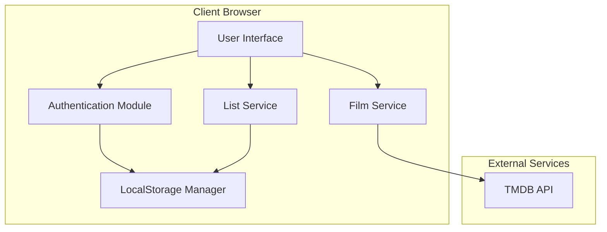
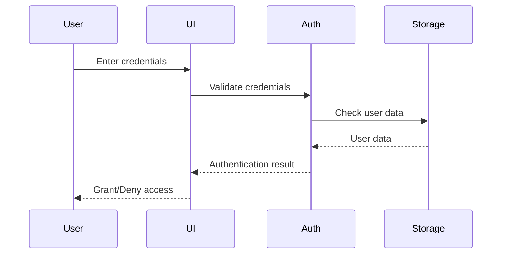

# Design Document - Letterboxd Manager

## Overview

O Letterboxd Manager é uma aplicação web single-page (SPA) construída com JavaScript vanilla ou framework leve, que integra com a API do TMDB (The Movie Database) para gerenciar uma lista compartilhada de filmes. A aplicação será hospedada no GitHub Pages e utilizará localStorage para persistência de dados de usuários e lista compartilhada.

A arquitetura seguirá um padrão client-side com três camadas principais:
- **Presentation Layer**: Interface do usuário com HTML/CSS/JavaScript
- **Business Logic Layer**: Gerenciamento de estado, autenticação e regras de negócio
- **Data Layer**: Integração com TMDB API e localStorage

## Architecture

### High-Level Architecture



### Technology Stack

- **Frontend**: Vanilla JavaScript (sem frameworks)
- **Styling**: CSS puro
- **API Client**: Fetch API nativa
- **Storage**: LocalStorage
- **Hosting**: GitHub Pages (sem build tool necessário)

### Authentication Flow



## Components and Interfaces

### 1. Authentication Module

**Responsibilities:**
- Validate user credentials
- Manage session state
- Hash passwords for security
- Check admin privileges

**Interface:**
```javascript
class AuthService {
  login(username, password): Promise<User>
  logout(): void
  getCurrentUser(): User | null
  isAuthenticated(): boolean
  isAdmin(): boolean
  hashPassword(password): string
}
```

### 2. User Management Module

**Responsibilities:**
- CRUD operations for users
- Store user data in localStorage
- Validate user input

**Interface:**
```javascript
class UserService {
  createUser(username, password): User
  updateUser(userId, updates): User
  deleteUser(userId): void
  getAllUsers(): User[]
  getUserById(userId): User | null
}
```

### 3. Film Service

**Responsibilities:**
- Fetch films from TMDB API
- Parse and format film data
- Handle API errors
- Search films by title
- Get popular/trending films
- Map genre IDs to genre names
- Support pagination

**Interface:**
```javascript
class FilmService {
  searchFilms(query, page): Promise<{films: Film[], totalPages: number}>
  getFilmDetails(filmId): Promise<Film>
  getPopularFilms(page): Promise<{films: Film[], totalPages: number}>
  getTrendingFilms(page): Promise<{films: Film[], totalPages: number}>
  getGenreName(genreId): string
  getGenreNames(genreIds): string[]
}
```

### 4. List Service

**Responsibilities:**
- Manage shared list in localStorage
- Add films to shared list
- Remove films from shared list
- Prevent duplicate entries
- Filter films by genre, name, or random order
- Apply combined filters
- Manage watched films list
- Move films from shared list to watched list
- Edit watched film ratings and reviews
- Remove films from watched list
- Filter watched films by genre, name, or random order

**Interface:**
```javascript
class ListService {
  addFilmToList(film, userId): FilmEntry
  getSharedList(): FilmEntry[]
  removeFilmFromList(filmId): void
  isFilmInList(filmId): boolean
  filterByGenre(genre, list): FilmEntry[]
  filterByName(searchText, list): FilmEntry[]
  filterRandom(list): FilmEntry[]
  applyFilters(filters, list): FilmEntry[]
  markAsWatched(filmId, rating, review, userId): WatchedFilm
  getWatchedList(): WatchedFilm[]
  updateWatchedRating(watchedId, newRating): void
  updateWatchedReview(watchedId, newReview): void
  removeFromWatched(watchedId): void
}
```

### 5. Storage Manager

**Responsibilities:**
- Abstract localStorage operations
- Handle data serialization
- Provide data migration if needed

**Interface:**
```javascript
class StorageManager {
  save(key, data): void
  load(key): any
  remove(key): void
  clear(): void
}
```

## Data Models

### User Model
```javascript
{
  id: string,           // UUID
  username: string,
  passwordHash: string,
  isAdmin: boolean,
  createdAt: timestamp
}
```

### Film Model
```javascript
{
  id: number,           // TMDB film ID
  title: string,
  poster: string,       // URL to poster image (TMDB path)
  rating: number,       // Average rating (vote_average from TMDB)
  genres: string[],     // Genre names
  year: number,         // Release year
  overview: string,     // Film description
  tmdbUrl: string       // Link to TMDB page
}
```

### FilmEntry Model
```javascript
{
  id: string,           // UUID for the entry
  film: Film,
  addedBy: string,      // Username
  addedAt: timestamp
}
```

### SharedList Model
```javascript
{
  entries: FilmEntry[]
}
```

### WatchedFilm Model
```javascript
{
  id: string,           // UUID for the watched entry
  film: Film,
  rating: number,       // User rating (1-5 stars)
  review: string,       // Review text instead of notes
  ratedBy: string,      // Username who gave the rating
  watchedAt: timestamp  // When it was marked as watched
}
```

### WatchedList Model
```javascript
{
  entries: WatchedFilm[]
}
```

## Correctness Properties

*A property is a characteristic or behavior that should hold true across all valid executions of a system-essentially, a formal statement about what the system should do. Properties serve as the bridge between human-readable specifications and machine-verifiable correctness guarantees.*


### Property Reflection

After reviewing all testable properties, several can be consolidated:

- Properties 5.2, 5.3, and 5.4 (displaying username, timestamp, and film fields) can be combined into a single comprehensive property about complete entry display
- Properties 4.2, 4.3, and 4.4 (recording username, timestamp, and film info) can be combined into a single property about complete entry storage
- Property 3.2 is redundant with 3.4 as parsing correctly implies displaying all fields

### Core Properties

**Property 1: User creation persistence**
*For any* valid username and password combination, when an admin creates a user, that user should exist in storage and be retrievable.
**Validates: Requirements 1.2**

**Property 2: User deletion completeness**
*For any* existing user, when an admin deletes that user, the user should no longer exist in storage and authentication attempts should fail.
**Validates: Requirements 1.3**

**Property 3: User update correctness**
*For any* existing user and valid credential updates, when an admin updates the user, the stored credentials should reflect the changes.
**Validates: Requirements 1.4**

**Property 4: Password hashing security**
*For any* password string, when stored in the system, the stored value should be a hash and not equal to the plain text password.
**Validates: Requirements 1.5**

**Property 5: Valid authentication success**
*For any* user with valid credentials, when those credentials are provided for login, authentication should succeed and grant access.
**Validates: Requirements 2.1**

**Property 6: Invalid authentication rejection**
*For any* invalid credential combination (wrong username or password), when provided for login, authentication should fail and return an error.
**Validates: Requirements 2.2**

**Property 7: Session persistence**
*For any* authenticated user, when performing actions before logout, the session should remain valid throughout.
**Validates: Requirements 2.3**

**Property 8: Protected route authentication**
*For any* protected route, when accessed without authentication, access should be denied.
**Validates: Requirements 2.4**

**Property 9: Film data parsing completeness**
*For any* valid TMDB API film response, when parsed by the system, all required fields (poster, title, rating, genre, overview) should be extracted correctly.
**Validates: Requirements 3.4, 3.6**

**Property 10: Film display completeness**
*For any* film data, when rendered in the UI, all required fields (poster, title, rating, genre) should be visible.
**Validates: Requirements 3.2**

**Property 11: Add option availability**
*For any* film in the listing, when displayed to a user, an option to add it to the shared list should be available.
**Validates: Requirements 4.1**

**Property 12: Film entry storage completeness**
*For any* film added to the shared list by any user, the stored entry should contain the film information (poster, title, rating, genre), the username who added it, and the timestamp when it was added.
**Validates: Requirements 4.2, 4.3, 4.4**

**Property 13: Duplicate prevention**
*For any* film, when added to the shared list twice, only one entry should exist in the list.
**Validates: Requirements 4.5**

**Property 14: List display completeness**
*For any* shared list with entries, when displayed, all entries should be visible to the user.
**Validates: Requirements 5.1**

**Property 15: Entry display completeness**
*For any* film entry in the shared list, when displayed, it should show the username who added it, the timestamp when it was added, and all film fields (poster, title, rating, genre).
**Validates: Requirements 5.2, 5.3, 5.4**

**Property 16: Tab switching to shared list**
*For any* UI state, when a user clicks on the shared list tab, the shared list view should be displayed.
**Validates: Requirements 7.2**

**Property 17: Tab switching to explore films**
*For any* UI state, when a user clicks on the explore films tab, the film exploration view should be displayed.
**Validates: Requirements 7.3**

**Property 18: Active tab state persistence**
*For any* tab selection, when a user switches tabs, the active tab state should be maintained until another tab is selected.
**Validates: Requirements 7.4**

**Property 19: Film detail view display**
*For any* film, when a user clicks on it, a detailed view with film information should be displayed.
**Validates: Requirements 8.1**

**Property 20: Synopsis display in details**
*For any* film detail view, when displayed, the film synopsis from the overview field should be visible, or a message indicating no synopsis is available if the field is empty.
**Validates: Requirements 8.2, 8.6**

**Property 21: Complete film details display**
*For any* film detail view, when displayed, it should show poster, title, rating, genres, and release year.
**Validates: Requirements 8.3**

**Property 22: Genre ID to name mapping**
*For any* valid TMDB genre ID, when the system processes it, it should map to the corresponding genre name.
**Validates: Requirements 9.1**

**Property 23: Genre names display**
*For any* film display, when showing genres, only genre names should appear, never numeric IDs.
**Validates: Requirements 9.2**

**Property 24: Multiple genres display**
*For any* film with multiple genres, when displayed, all genre names should be shown in a readable format.
**Validates: Requirements 9.3**

**Property 25: Page size limit**
*For any* page of films, when displayed, the number of films should not exceed the configured page size.
**Validates: Requirements 10.1**

**Property 26: Page navigation**
*For any* valid page number, when a user navigates to that page, the system should load and display films for that page.
**Validates: Requirements 10.3**

**Property 27: Pagination info display**
*For any* paginated view, when displayed, the current page number and total pages should be visible.
**Validates: Requirements 10.6**

**Property 28: Genre filter**
*For any* genre and shared list, when a user applies a genre filter, only films matching that genre should be displayed.
**Validates: Requirements 11.2**

**Property 29: Name filter**
*For any* search text and shared list, when a user applies a name filter, only films whose titles contain the search text should be displayed.
**Validates: Requirements 11.3**

**Property 30: Random filter**
*For any* shared list, when a user applies random filter multiple times, the order of films should vary.
**Validates: Requirements 11.4**

**Property 31: Combined filters**
*For any* combination of filters and shared list, when a user applies multiple filters, only films matching all criteria should be displayed.
**Validates: Requirements 11.5**

**Property 32: Clear filters**
*For any* filtered shared list, when a user clears all filters, all films in the shared list should be displayed.
**Validates: Requirements 11.6**

**Property 33: Mark as watched transition**
*For any* film in the shared list, when a user marks it as watched, it should appear in the watched films list and be removed from the shared list.
**Validates: Requirements 12.2, 12.6**

**Property 34: Rating prompt**
*For any* film being marked as watched, when the action is triggered, the system should prompt for a rating.
**Validates: Requirements 12.3**

**Property 35: Watched film rating display**
*For any* watched film, when displayed, the rating given during movie night should be visible.
**Validates: Requirements 12.4**

**Property 36: Watched film metadata display**
*For any* watched film, when displayed, it should show who added the rating and when it was added.
**Validates: Requirements 12.5**

**Property 37: Admin-only mark as watched**
*For any* user with isAdmin=false, when attempting to mark a film as watched, the operation should be rejected.
**Validates: Requirements 12.8**

**Property 38: Admin edit rating option availability**
*For any* watched film displayed to an admin, when rendered, an option to edit the rating should be present.
**Validates: Requirements 13.1**

**Property 39: Admin edit review option availability**
*For any* watched film displayed to an admin, when rendered, an option to edit the review should be present.
**Validates: Requirements 13.2**

**Property 40: Rating update persistence**
*For any* watched film and new rating value, when an admin updates the rating, the stored rating should reflect the new value.
**Validates: Requirements 13.3**

**Property 41: Review update persistence**
*For any* watched film and new review text, when an admin updates the review, the stored review should reflect the new text.
**Validates: Requirements 13.4**

**Property 42: Admin remove option availability**
*For any* watched film displayed to an admin, when rendered, an option to remove it from the watched list should be present.
**Validates: Requirements 13.5**

**Property 43: Watched film removal completeness**
*For any* watched film, when an admin removes it, the film should no longer exist in the watched list.
**Validates: Requirements 13.6**

**Property 44: Non-admin edit prevention**
*For any* user with isAdmin=false, when attempting to edit or remove watched films, the operations should be rejected.
**Validates: Requirements 13.7**

**Property 45: Filter immediate update**
*For any* genre filter applied to the shared list, when applied, the displayed films should immediately match the filter criteria.
**Validates: Requirements 14.1**

**Property 46: Random order variation**
*For any* shared list, when random order is applied multiple times, the resulting orderings should differ.
**Validates: Requirements 14.2**

**Property 47: Filter state persistence**
*For any* filter applied to a list, when applied, the filter state should remain active until explicitly changed or cleared.
**Validates: Requirements 14.3**

**Property 48: Filtered count accuracy**
*For any* filtered list, when displayed, the film count should match the number of films that pass the filter criteria.
**Validates: Requirements 14.4**

**Property 49: Watched films genre filter**
*For any* genre and watched list, when a genre filter is applied, only watched films matching that genre should be displayed.
**Validates: Requirements 15.2**

**Property 50: Watched films name filter**
*For any* search text and watched list, when a name filter is applied, only watched films whose titles contain the search text should be displayed.
**Validates: Requirements 15.3**

**Property 51: Watched films random order**
*For any* watched list, when random order is applied multiple times, the resulting orderings should differ.
**Validates: Requirements 15.4**

**Property 52: Watched films combined filters**
*For any* combination of filters and watched list, when applied, only watched films matching all criteria should be displayed.
**Validates: Requirements 15.5**

**Property 53: Watched films clear filters**
*For any* filtered watched list, when filters are cleared, all watched films should be displayed.
**Validates: Requirements 15.6**

**Property 54: Button state for listed films**
*For any* film already in the shared list, when displayed in the explore tab, the button should show "remove" instead of "add".
**Validates: Requirements 16.1**

**Property 55: Remove button functionality**
*For any* film in the shared list, when the remove button is clicked, the film should be removed from the shared list.
**Validates: Requirements 16.2**

**Property 56: Button state after removal**
*For any* film removed from the shared list, when displayed in the explore tab, the button should show "add" instead of "remove".
**Validates: Requirements 16.3**

**Property 57: Visual indication of listed films**
*For any* film in the explore tab, when it exists in the shared list, it should be visually indicated.
**Validates: Requirements 16.4**

**Property 58: Immediate button state update**
*For any* film, when added to or removed from the shared list, the button state should update immediately.
**Validates: Requirements 16.5**

## Error Handling

### Authentication Errors
- Invalid credentials: Display clear error message
- Session expiration: Redirect to login page
- Unauthorized access: Block and redirect to login

### API Errors
- Network failures: Display retry option
- Invalid API responses: Log error and show user-friendly message
- Rate limiting: Queue requests and retry with exponential backoff
- Authentication failures: Prompt for API key reconfiguration
- TMDB API quota exceeded: Display informative message

### Data Validation Errors
- Empty username/password: Prevent submission with validation message
- Duplicate usernames: Show error and suggest alternatives
- Invalid film data: Skip malformed entries and log warnings

### Storage Errors
- localStorage full: Notify user and suggest clearing old data
- localStorage unavailable: Fallback to session-only mode with warning
- Data corruption: Attempt recovery or reset with user confirmation

## Testing Strategy

### Unit Testing

The application will use **Jest** as the testing framework for unit tests. Unit tests will focus on:

- Individual service methods (AuthService, UserService, FilmService, ListService)
- Data validation functions
- Utility functions for hashing, formatting, etc.
- Error handling paths
- Edge cases like empty inputs, null values, boundary conditions

Example unit test areas:
- Password hashing produces different outputs for different inputs
- Empty list displays appropriate message
- API error responses are handled correctly
- Duplicate film detection works with same film ID

### Property-Based Testing

The application will use **fast-check** (JavaScript property-based testing library) for property tests. Each property test will:

- Run a minimum of 100 iterations with randomly generated inputs
- Be tagged with a comment referencing the design document property
- Use the format: `// Feature: letterboxd-manager, Property X: [property text]`
- Test universal behaviors across all valid inputs

Property tests will cover:
- User CRUD operations maintain data integrity
- Authentication works correctly for all valid/invalid credential combinations
- Film data parsing handles all valid API response formats
- List operations maintain consistency (no duplicates, complete data storage)
- All displayed data includes required fields

### Integration Testing

Integration tests will verify:
- End-to-end user flows (login → browse films → add to list)
- Interaction between services (e.g., ListService + FilmService + API)
- localStorage persistence across page reloads
- API integration with mock TMDB API responses

### Test Data Generation

For property-based tests, generators will be created for:
- Random usernames and passwords (various lengths, special characters)
- Random film data (valid and edge cases)
- Random user actions and sequences
- Random API responses (success, failure, malformed)

## Security Considerations

### Password Security
- Use bcrypt.js (biblioteca leve) para hashing de senhas
- Nunca armazenar senhas em texto plano

### API Key Management
- Armazenar credenciais da API do TMDB em arquivo de configuração separado
- Não commitar credenciais no repositório (usar .gitignore)
- TMDB API key é gratuita e pode ser obtida em https://www.themoviedb.org/settings/api

### Session Management
- Implementar timeout de sessão simples
- Limpar dados sensíveis no logout

### Input Validation
- Validar inputs do usuário antes de processar
- Sanitizar dados de filmes antes de exibir

## Performance Considerations

### Optimization Strategies
- Lazy load de imagens de pôsteres
- Cache simples de respostas da API
- Debouncing para campos de busca (se implementado)

### Bundle Size
- Sem dependências externas pesadas
- Apenas bcrypt.js para hashing
- Código JavaScript vanilla mantém o bundle mínimo

## Deployment

### GitHub Pages Setup
1. Criar estrutura de arquivos estáticos (HTML, CSS, JS)
2. Configurar GitHub Pages para servir da branch `main` ou pasta `/docs`
3. Configurar arquivo de configuração para TMDB API key (não commitado)

### TMDB API Integration
- Base URL: `https://api.themoviedb.org/3`
- Image Base URL: `https://image.tmdb.org/t/p/w500` (para posters)
- Endpoints principais:
  - `/movie/popular` - Filmes populares
  - `/trending/movie/week` - Filmes em alta
  - `/search/movie` - Buscar filmes
  - `/movie/{id}` - Detalhes do filme

### Estrutura de Arquivos
```
/
├── index.html
├── admin.html
├── css/
│   └── styles.css
├── js/
│   ├── auth.js
│   ├── users.js
│   ├── films.js
│   ├── list.js
│   ├── storage.js
│   ├── tabs.js (new - tab navigation)
│   └── filters.js (new - filtering logic)
├── config.example.js (template para configuração)
└── README.md
```

## UI/UX Enhancements

### Tab Navigation
A interface principal terá três abas:
1. **Explorar Filmes**: Listagem paginada de filmes do TMDB com indicação visual de filmes já adicionados
2. **Lista Compartilhada**: Filmes adicionados pelo grupo com filtros
3. **Filmes Assistidos**: Histórico de filmes assistidos com avaliações (apenas Admin pode marcar como assistido)

### Film Detail Modal
Ao clicar em um filme, um modal/overlay será exibido com:
- Pôster em tamanho maior
- Título e ano
- Sinopse completa
- Gêneros (como nomes)
- Avaliação do TMDB
- Botão para adicionar à lista ou remover da lista (dependendo do estado)
- Botão para marcar como assistido (apenas para Admin na lista compartilhada)

### Filtering System
A aba de Lista Compartilhada e Filmes Assistidos terão:
- Filtro por gênero (dropdown ou tags)
- Filtro por nome (campo de busca)
- Botão de ordenação aleatória (gera nova ordem a cada clique)
- Filtros podem ser combinados
- Botão para limpar todos os filtros
- Contador de filmes filtrados
- Atualização imediata ao aplicar filtros

### Pagination
A aba de Explorar Filmes terá:
- Controles de navegação (anterior/próximo)
- Indicador de página atual e total
- Limite de filmes por página (ex: 20 filmes)
- Desabilitar controles nas extremidades

### Rating System
Sistema de avaliação de 1 a 5 estrelas:
- Interface visual com estrelas clicáveis
- Exibição de estrelas preenchidas para filmes assistidos
- Admin pode editar avaliações existentes
- Reviews em formato de texto livre

### Button States
Botões dinâmicos na aba de Explorar Filmes:
- "Adicionar à Lista" para filmes não adicionados
- "Retirar da Lista" para filmes já na lista compartilhada
- Atualização imediata do estado após ações
- Indicação visual clara do estado atual

### Admin Controls
Controles exclusivos para Admin:
- Marcar filmes como assistidos (com prompt para rating e review)
- Editar ratings e reviews de filmes assistidos
- Remover filmes da lista de assistidos
- Todos os controles com confirmação para ações destrutivas
